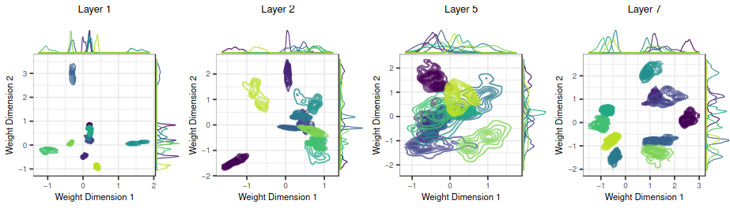

# Connecting the Dots



This repository contains code for creating the results for the ICML 2024 paper *"Connecting the Dots: Is Mode-Connectedness the Key to Feasible Sample-Based Inference in Bayesian Neural Networks?"*.

## Getting Started

Run `pip install -r requirements.txt` from the root of the folder. We use python `3.10` and using a virtual enviroment is highly encouraged. Also `Docker` is required to run the experiments.

## File Structure

```
├── data
├── experiments
|   ├── fcn_bnns
|   └── fcn_ensembles
├── notebooks
├── probabilisticml # toolbox for probabilistic ML
├── results
|   ├── de
|   └── fcn_bnns
└── src 
```

## Usage

Fit a fully connected Bayesian neural network to a dataset in `data/` with the following steps:

1. Specify the experiment configuration in `experiments/fcn_bnns/conifg.yaml`. The configuration file should be self-explanatory.
2. If one wants to fit a BDE, make sure that the final weigth dictionaries of the DE are stored in a folder matching the config that looks like this: `results/de/{dataset}|{hidden_structure}|{activation}|{replication}|/`. Then the BDE will be trained on the DE's final weights.
3. Run `docker compose -f docker-compose-fcn-bnn.yml up --build` from the root of the repository if you want to monitor the progressbars and prints. Otherwise, run `docker compose -f docker-compose-fcn-bnn.yml up --build -d` to run the experiment in the background.
4. The results will be saved in `experiments/fcn_bnns/results/fcn_bnns/` folder with a timestamped folder name. The results contain the posterior samples, the model configuration `.json` file, and the overall config of the experiments and a `.txt` file reporting the runtime of the individual experiments.
5. Aggregate various statistics from the results by running `python ../../../experiments/fcn_bnns/aggregate_cross_exp.py` from the experiments folder. This will create a `.csv` file with the aggregated statistics in the the same folder. Examples for the reported stats are hold out RMSE, LPPD, the configurations of the experiments, and the runtime of the individual experiments.

Baseline and additional experiments can be run as follows:

* Use `experiments/fcn_ensembles/fcn_main.ipynb` to compute the deep-ensemble baseline. The corresponding hyperparameter search is conducted in `experiments/fcn_ensembles/fcn_hpo.ipynb`
* Use `experiments/rf_tuning.py` to tune the hyperparameters of the random forest baseline.
* Use `experiments/samp_path_exp` to run and visualize the decomposition of the sampling path.

## Analysis of Results

Some parts of the results e.g. traces, predictions, and the model configuration can be interactively explored with the streamlit UI. To run the UI, run `streamlit run 1_experiment_ui.py` from the `experiments/fcn_bnns/` folder.

Notebooks for the specific analyses of the results are in the `notebooks/` folder. 

- `FCNBNNDiagnostics.ipynb` contains code for the following analyses:
    - Performance analysis along a grid of chains and samples (both for RMSE and LPPD)
    - Assessment of calibration of the posterior predictive distribution
    - Evaluation of both parameter space and function space diagnostics
- `FCNBNNLastLayerSymmetries.ipynb` covers bivariate visualizations of the posterior samples for various layers.
- `FCNBNNSlopes.ipynb` contains code for the analysis of the slopes of the posterior samples' traces.
- `FCNBNNWarmstart.ipynb` trains an equivalent DNN to warmstart a BNN i.e. train DEI-MCMC.
- `FCNBNNEnsemblePerformance.ipynb` evaluates the DE baseline.

## Citation

If you use this code in your research, please cite the following paper:

```
@inproceedings{sommer2024connecting,
  title={Connecting the Dots: Is Mode-Connectedness the Key to Feasible Sample-Based Inference in Bayesian Neural Networks?},
  author={Sommer, Emanuel and Wimmer, Lisa and Papamarkou, Theodore and Bothmann, Ludwig and Bischl, Bernd and R{\"u}gamer, David},
  booktitle={Proceedings of the 41st International Conference on Machine Learning},
  volume={235},
  year={2024},
  publisher={PMLR},
}
```
